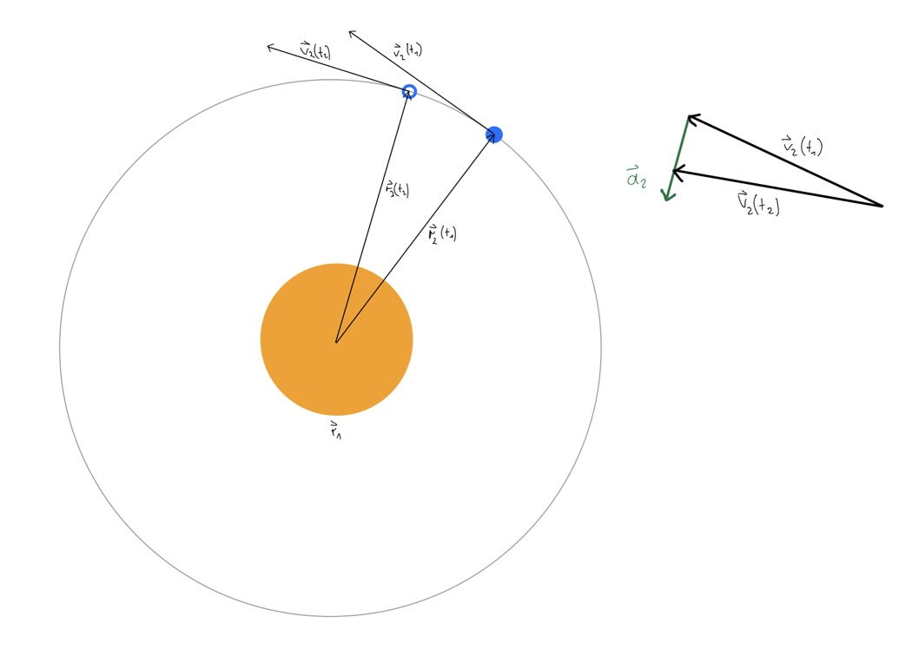

# Aufgabe, Teil 1

### A-3, a

Kennzahlen zum Sonnensystem.

**Sonne**  
Masse: 1,9884*10^30 kg  
Äquatorradius: 696.342.000 m

**Merkur**  
Masse: 3,301*10^23 kg  
Äquatorradius: 2.439.700 m  
Bahngeschwindigkeit: 47.360 m/s  
Minimaler Abstand zur Sonne (Perihel): 46.001.200.000 m  
Maximaler Abstand zur Sonne (Aphel): 69.816.900.000 m  
Mittlerer Abstand zur Sonne (Große Halbachse): 57.909.050.000 m

**Venus**  
Masse: 4.8675*10^24 kg  
Äquatorradius: 6.051.800 m  
Bahngeschwindigkeit: 35.020 m/s  
Perihel: 107.477.000.000 m  
Aphel: 108.939.000.000 m  
Große Halbachse: 108.208.000.000 m

**Erde**  
Masse: 5,97237*10^24 kg  
Äquatorradius: 6.378.160 m  
Bahngeschwindigkeit: 29.780 m/s  
Perihel: 147.095.000.000 m  
Aphel: 152.100.000.000 m  
Große Halbachse: 149.598.023.000 m

**Mars**  
Masse: 6,4171*10^23 kg  
Äquatorradius: 3.396.200 m  
Bahngeschwindigkeit: 24.007 m/s  
Perihel: 206.700.000.000 m  
Aphel: 249.200.000.000 m  
Große Halbachse: 227.939.200.000 m

**Jupiter**  
Masse: 1,8982*10^27 kg  
Äquatorradius: 71.492.000 m  
Bahngeschwindigkeit: 13.070 m/s  
Perihel: 740.520.000.000 m  
Aphel: 816.620.000.000 m  
Große Halbachse: 778.570.000.000 m

**Saturn**  
Masse: 5,6834*10^26 kg  
Äquatorradius: 60.268.000 m  
Bahngeschwindigkeit: 9.680 m/s  
Perihel: 1,35255*10^12 m  
Aphel: 1,51450*10^12 m  
Große Halbachse: 1,43353*10^12 m

**Uranus**  
Masse: 8,6810*10^25 kg  
Äquatorradius: 25.559 m  
Bahngeschwindigkeit: 6.800 m/s  
Perihel: 2,742*10^12 m  
Aphel: 3,008*10^12 m  
Große Halbachse: 2,87504*10^12 m

**Neptun**  
Masse: 1,02413*10^26 kg  
Äquatorradius: 24.764.000 m  
Bahngeschwindigkeit: 5.430 m/s  
Perihel: 4,46*10^15 m  
Aphel: 4,54*10^15 m  
Große Halbachse: 4,5*10^15 m

### A-3, b

Formel zur Gravitationskraft.
Bei *G* handelt es sich um die **Gravitationskonstante**, einer fundamentalen Naturkonstante.

Mit der *Punktmasse* oder dem *Massepunkt* wird die Masse eines Körpers auf
seinen Mittelpunkt konzentriert. Mathematisch wird der Körper also als Punkt gesehen.
Das erleichtert die Berechnung seiner Bewegung im Raum.

### A-3, c

Skizze der Erdbahn.

### A-3, d

Die Erde umläuft die Sonne auf einer stabilen Bahn, weil sich die gegenseitigen *Anziehungskräfte* beider Körper mit der durch die Bewegung der Erde um die Sonne entstehenden *Fliehkraft* miteinander aufheben.  
Es wirken also zwei gegensätzliche Kräfte.
